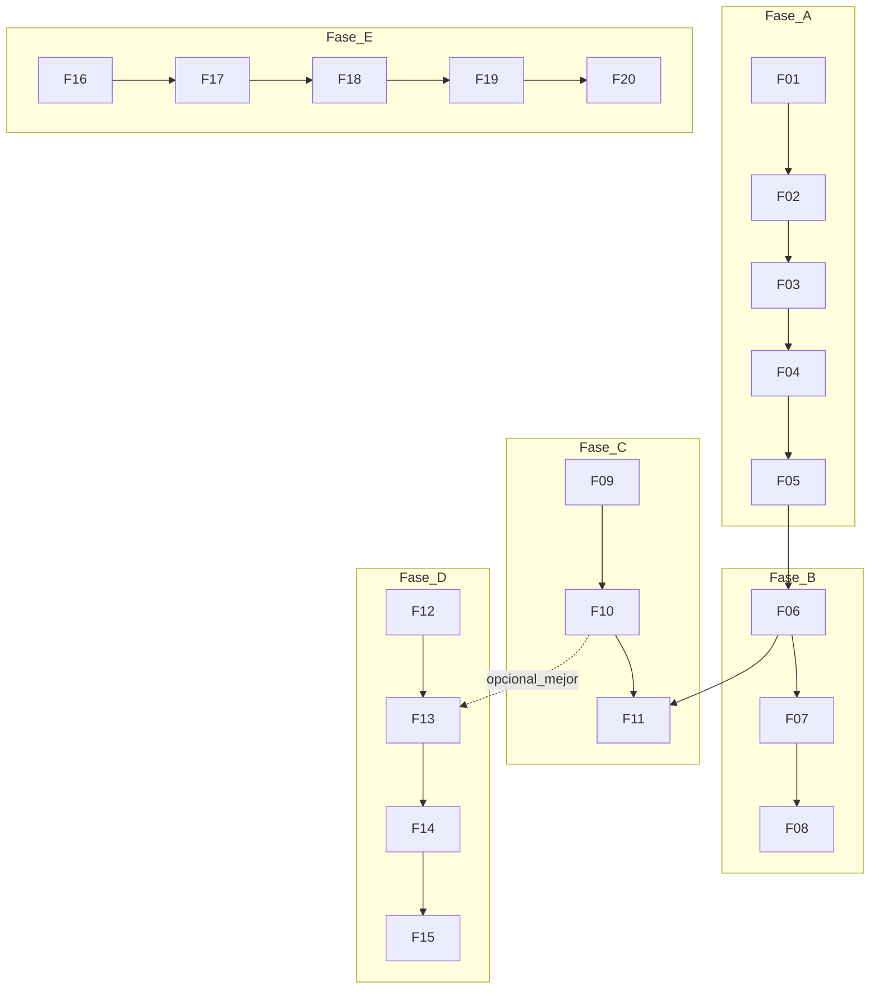

# Plan de implementación: 20 funcionalidades BeerFinder

## Propósito y audiencia

Este documento es la **hoja de ruta ejecutable** para añadir 20 funcionalidades al proyecto, **una por entrega**, con criterios de aceptación y verificación explícitos.

- **Audiencia:** desarrolladores del repo.
- **Contexto ampliado:** ideas y filosofía en [`UPGRADE_IDEAS.md`](./UPGRADE_IDEAS.md).
- **Tras cada implementación:** levantar el stack, recorrer rutas y APIs afectadas sin errores 500 ni 404 donde corresponda (regla del proyecto en [`.cursor/rules/post-implementation-verify.mdc`](../.cursor/rules/post-implementation-verify.mdc)).

## Alcance del plan

- Definir **qué** construir, en **qué orden**, con **cómo validar**.
- Cada feature en rama propia (`feature/Fxx-nombre-corto`), merge independiente cuando cumpla criterios.

## Fuera de alcance (salvo decisión explícita)

- Sustituir OpenStreetMap por un proveedor de mapas de pago (salvo acuerdo al abordar F01/F05).
- Motor de rutas propio (F15 usa enlaces externos).
- Moderación humana 24/7 o SLA de revisión de reportes (F16 puede empezar solo con almacenamiento + admin).

---

## Fases (hitos)

| Fase | Nombre | Features | Idea |
|------|--------|----------|------|
| **A** | Mapa base | F01–F05 | Zoom, ubicación, URL, clustering, geocodificación |
| **B** | Modelo POI rico | F06–F08 | Tipo de local, horarios, “abierto ahora” |
| **C** | Engagement | F09–F11 | Favoritos, valoraciones, comodidades |
| **D** | Descubrimiento | F12–F15 | Estilos agregados, listas por zona, visitas, tour |
| **E** | Contenido y ops | F16–F20 | Reportes, galería, CSV admin, analytics, PWA |

**Orden lineal recomendado dentro del plan global:** F01 → F02 → … → F20 (el orden minimiza bloqueos; F08 requiere F07).

---

## Tabla resumen

| ID | Feature | Fase | Depende de | Tamaño | Inspiración (referencia de mercado / sector) |
|----|---------|------|------------|--------|-----------------------------------------------|
| F01 | Zoom máximo y límites de teselas | A | — | S | Leaflet / mapas de detalle |
| F02 | Botón “Mi ubicación” con zoom alto | A | — | S | Apps de descubrimiento móvil |
| F03 | Enlaces profundos `?poi=<id>` | A | — | M | Localizadores web, compartir vista |
| F04 | Clustering de marcadores | A | — | M | Mapas con muchos POIs |
| F05 | Búsqueda geográfica (geocodificación) | A | — | L | Storemapper / buscador en localizadores |
| F06 | Tipo de local + filtro | B | — | M | BreweryDB (filtros por tipo) |
| F07 | Horarios semanales en POI | B | — | L | OSM opening_hours / fichas de negocio |
| F08 | Indicador “abierto ahora” | B | F07 | S | Horarios en tiempo real |
| F09 | Favoritos por usuario | C | — | M | BreweryMap (wishlist) |
| F10 | Valoración (estrellas) por POI | C | — | M | Finding Beer (escala de calidad) |
| F11 | Comodidades (flags) + filtros | C | F06 | M | BreweryDB (amenidades) |
| F12 | Estilos de cerveza en el local | D | Items/POI existentes | M | Finding Beer (estilos por cervecería) |
| F13 | Listas por zona (bbox/región) | D | F10 opcional | M | Finding Beer (listas por zona) |
| F14 | Registro “He visitado” | D | — | M | BreweryMap (visit logging) |
| F15 | Tour / ruta con navegación externa | D | — | M | BreweryDB (BreweryRoutes) |
| F16 | Reportar POI | E | — | M | Gobierno de datos POI |
| F17 | Galería multip foto por POI | E | — | L | Metadatos ricos en APIs POI |
| F18 | Importación CSV (admin) | E | — | M | Import CSV en localizadores |
| F19 | Métricas de vistas de ficha | E | — | S | Analytics en localizadores |
| F20 | PWA mínima | E | — | M | Mobile / instalación |

*Tamaño relativo: S = corto, M = medio, L = grande (orden de magnitud, no días fijos).*

---

## Dependencias entre features (vista mínima)

La cadena **F01→…→F05** y **F06→F07→F08** es la crítica técnica; **F11** asume **F06** (filtros combinados). **F13** gana orden por rating si **F10** ya existe (línea punteada).

---

## Rutas actuales del frontend (referencia para verificación)

Rutas definidas en `frontend/src/App.tsx`:

| Ruta | Página |
|------|--------|
| `/` | Mapa (`MapPage`) |
| `/auth` | Autenticación |
| `/profile` | Perfil |
| `/items` | Ítems |
| `/pois` | Lista POIs |
| `/item-requests` | Solicitudes de ítem |
| `/item-requests/all` | Todas las solicitudes |

Tras F03, las URLs compartidas pueden ser `/?poi=<id>` (u otra convención documentada). Comprobar recarga directa y pestaña en privado.

---

## Plantilla de trabajo (cada Fxx)

1. Rama `feature/Fxx-nombre-corto`.
2. Backend: modelo/migración, serializers, vistas, permisos, tests en `tests/backend/` si aplica.
3. Frontend: `types/`, servicios, componentes, i18n `frontend/public/locales/en` y `es`.
4. Ejecutar el proyecto (p. ej. `docker compose -f docker-compose.dev.yml up`).
5. Verificación manual: rutas tocadas + Network (sin 500 en APIs usadas; sin 404 en assets y rutas nuevas).
6. Tests automáticos en `tests/frontend/` u otras carpetas existentes si cubren el área.

---

## Anexo: fichas F01–F20

### F01 — Zoom máximo y límites de teselas

| Campo | Contenido |
|-------|-----------|
| **Objetivo** | Permitir el máximo acercamiento coherente con el proveedor de teselas, sin mapa roto ni POIs imposibles de colocar. |
| **Dependencias** | Ninguna. |
| **Criterios de aceptación** | `maxZoom`/`minZoom` alineados en `MapContainer` y `TileLayer`; al zoom máximo no aparecen teselas grises sistemáticas; crear POI sigue funcionando. |
| **Tareas técnicas** | Frontend: `frontend/src/components/MapComponent.tsx`, `MapComponent.css` si hace falta UI de zoom. Tests: `tests/frontend/MapComponent.test.tsx` si aplica. |
| **Verificación manual** | `/`: acercar al máximo, pan, abrir popup, flujo crear POI (usuario logueado). |
| **Riesgos / notas** | Zoom por encima del máximo real del tile server requiere overzoom explícito o otro proveedor. |

### F02 — Botón “Mi ubicación” con zoom alto

| Campo | Contenido |
|-------|-----------|
| **Objetivo** | Un control visible que centre el mapa en el usuario con zoom alto (p. ej. 17–19) para colocar POIs con precisión. |
| **Dependencias** | Ninguna (F01 recomendable para límites claros). |
| **Criterios de aceptación** | Botón o FAB visible; éxito → mapa centrado y zoom alto; denegación/timeout → mensaje claro (toast o texto), sin crash. |
| **Tareas técnicas** | `MapComponent.tsx` (hook `useMap` o componente hijo), traducciones i18n. |
| **Verificación manual** | `/`: permitir y denegar geolocalización en el navegador. |
| **Riesgos / notas** | HTTPS o localhost para Geolocation API; precisión variable en interiores. |

### F03 — Enlaces profundos `?poi=<id>`

| Campo | Contenido |
|-------|-----------|
| **Objetivo** | Abrir un POI concreto desde URL compartida: centrar mapa y mostrar ficha o resaltar marcador. |
| **Dependencias** | Ninguna. |
| **Criterios de aceptación** | Pegar URL con `poi` válido centra y muestra UI de detalle; ID inválido: mensaje amable sin 500; F5 mantiene comportamiento. |
| **Tareas técnicas** | `MapPage.tsx` / `MapComponent.tsx`, `useSearchParams`; posible ajuste de `poiService` si hace falta GET por id. |
| **Verificación manual** | `/` y `/?poi=<id>` en ventana privada y recarga. |
| **Riesgos / notas** | Sincronizar estado mapa ↔ URL sin bucles de efectos. |

### F04 — Clustering de marcadores

| Campo | Contenido |
|-------|-----------|
| **Objetivo** | Agrupar POIs cuando hay muchos puntos en zoom bajo; expandir al hacer clic. |
| **Dependencias** | Ninguna. |
| **Criterios de aceptación** | Con N POIs de prueba, clusters visibles bajo cierto zoom; clic descompone o acerca; popups siguen accesibles. |
| **Tareas técnicas** | `MapComponent.tsx`; dependencia tipo `leaflet.markercluster` + estilos; revisar licencia y bundle size. |
| **Verificación manual** | `/` con dataset denso; zoom in/out. |
| **Riesgos / notas** | Interacción con F03 (marcador seleccionado) y SSR/hidratación si existiera. |

### F05 — Búsqueda geográfica

| Campo | Contenido |
|-------|-----------|
| **Objetivo** | Buscar ciudad/dirección y centrar el mapa en el resultado. |
| **Dependencias** | Ninguna. |
| **Criterios de aceptación** | Input de búsqueda; resultado centra mapa; fallo de red o sin resultados: feedback claro; cumplir política del geocoder (p. ej. Nominatim). |
| **Tareas técnicas** | Nuevo componente + servicio (fetch a API pública o proxy backend para no exponer/abuse desde cliente). |
| **Verificación manual** | `/`: varias consultas; simular error de red. |
| **Riesgos / notas** | Límites de uso Nominatim; considerar caché y debounce. |

### F06 — Tipo de local + filtro

| Campo | Contenido |
|-------|-----------|
| **Objetivo** | Clasificar POIs (bar, cervecería, tienda, etc.) y filtrar en lista y/o mapa. |
| **Dependencias** | Ninguna. |
| **Criterios de aceptación** | Campo persistido en API; crear/editar/listar; filtro reduce resultados correctamente. |
| **Tareas técnicas** | `backend/api/models.py`, migración, serializers, `POIViewSet`; `frontend/src/types/poi.ts`, `POIsPage.tsx`, modales create/edit. |
| **Verificación manual** | `/pois`, `/`, formularios de POI. |
| **Riesgos / notas** | Valores del enum y migración de datos existentes (default). |

### F07 — Horarios semanales

| Campo | Contenido |
|-------|-----------|
| **Objetivo** | Guardar y editar horarios por día (incl. varias franjas). |
| **Dependencias** | F06 en paralelo posible; no bloquea F06. |
| **Criterios de aceptación** | CRUD en API con validación; UI semanal en edición; datos nulos = “sin horario”. |
| **Tareas técnicas** | Modelo (JSONField o tablas normalizadas), serializers, `EditPOIModal` / vista detalle. |
| **Verificación manual** | Editar POI con dos franjas un día; guardar y recargar. |
| **Riesgos / notas** | Zona horaria del local vs del usuario (documentar en UI). |

### F08 — “Abierto ahora”

| Campo | Contenido |
|-------|-----------|
| **Objetivo** | Mostrar si el local está abierto en el instante actual según horarios guardados. |
| **Dependencias** | **F07** |
| **Criterios de aceptación** | Badge o texto en popup/modal; caso sin horarios: estado neutro; pruebas con datos conocidos. |
| **Tareas técnicas** | Utilidad en frontend o campo calculado en serializer; i18n. |
| **Verificación manual** | POI con horario que incluye/excluye “ahora”. |
| **Riesgos / notas** | DST y TZ; tests unitarios con reloj mockeado. |

### F09 — Favoritos

| Campo | Contenido |
|-------|-----------|
| **Objetivo** | Que cada usuario guarde POIs favoritos y los liste. |
| **Dependencias** | Ninguna. |
| **Criterios de aceptación** | Añadir/quitar favorito; lista solo del propio usuario; API con permisos correctos. |
| **Tareas técnicas** | Modelo M2M o tabla intermedia User–POI; endpoints; UI (corazón en ficha y/o `/profile`). |
| **Verificación manual** | Dos usuarios: favoritos aislados. |
| **Riesgos / notas** | Rate limiting en toggles si hay abuso. |

### F10 — Valoración por POI

| Campo | Contenido |
|-------|-----------|
| **Objetivo** | Puntuación 1–5 (o estrellas) agregada por POI. |
| **Dependencias** | Ninguna. |
| **Criterios de aceptación** | Un voto por usuario (o regla documentada); media visible; no 500 en re-voto. |
| **Tareas técnicas** | Modelo `POIRating` o similar; serializers; UI en `ViewPOIModal` o detalle. |
| **Verificación manual** | Votar, recargar, segundo usuario. |
| **Riesgos / notas** | Moderación de fraude; opción solo lectura al inicio. |

### F11 — Comodidades + filtros

| Campo | Contenido |
|-------|-----------|
| **Objetivo** | Flags (terraza, mascotas, comida, accesibilidad…) y filtrado combinado con tipo de local. |
| **Dependencias** | **F06** |
| **Criterios de aceptación** | Flags persistidos; filtros múltiples en UI; paginación/listados coherentes. |
| **Tareas técnicas** | Extender modelo POI; filtros en queryset; UI checkboxes. |
| **Verificación manual** | `/pois` y mapa con filtros activos. |
| **Riesgos / notas** | No explotar combinaciones de índices en BD sin revisar queries. |

### F12 — Estilos de cerveza en el local

| Campo | Contenido |
|-------|-----------|
| **Objetivo** | Mostrar qué estilos/sabores representan los ítems enlazados al POI (agregación). |
| **Dependencias** | Modelos `Item` / `POIItem` existentes. |
| **Criterios de aceptación** | POI sin ítems: vacío o mensaje; con ítems: lista o nube derivada de `flavor_type` u otro campo acordado. |
| **Tareas técnicas** | Anotación en serializer o query; componente en vista POI. |
| **Verificación manual** | POI con 0, 1 y N ítems. |
| **Riesgos / notas** | Rendimiento si N ítems es grande (distinct en SQL). |

### F13 — Listas por zona

| Campo | Contenido |
|-------|-----------|
| **Objetivo** | Listar POIs en una región (bbox o etiqueta geográfica) con orden útil. |
| **Dependencias** | **F10** opcional para orden por rating; sin F10, orden por nombre o fecha. |
| **Criterios de aceptación** | Parámetros de región documentados; resultados consistentes con mapa para misma bbox. |
| **Tareas técnicas** | Filtro geoespacial en backend PostGIS; página o panel en frontend. |
| **Verificación manual** | Comparar conteos mapa vs lista. |
| **Riesgos / notas** | Límites de resultado y paginación obligatoria. |

### F14 — “He visitado”

| Campo | Contenido |
|-------|-----------|
| **Objetivo** | Registrar visita del usuario a un POI con fecha. |
| **Dependencias** | Ninguna. |
| **Criterios de aceptación** | Marcar/desmarcar o registro con fecha; historial en perfil o lista propia. |
| **Tareas técnicas** | Modelo visita; endpoints; UI en ficha y `/profile`. |
| **Verificación manual** | Usuario ve solo sus visitas. |
| **Riesgos / notas** | Privacidad (no mostrar visitas a otros). |

### F15 — Tour / ruta externa

| Campo | Contenido |
|-------|-----------|
| **Objetivo** | Seleccionar varios POIs y abrir navegación en app externa en orden. |
| **Dependencias** | Ninguna. |
| **Criterios de aceptación** | Selección múltiple en UI; enlace OSM Directions o Google Maps con waypoints; documentar límites de waypoints. |
| **Tareas técnicas** | Estado de selección en `MapComponent` o página dedicada; utilidad URL builder. |
| **Verificación manual** | 2 y 5 paradas; comprobar que se abre el destino esperado. |
| **Riesgos / notas** | URLs largas; no garantizar óptimo TSP. |

### F16 — Reportar POI

| Campo | Contenido |
|-------|-----------|
| **Objetivo** | Enviar reporte (cerrado, duplicado, mal ubicado…) para revisión. |
| **Dependencias** | Ninguna. |
| **Criterios de aceptación** | Formulario + persistencia; solo staff ve listado o export (o email si se configura). |
| **Tareas técnicas** | Modelo `POIReport`; permisos; UI modal; opcional Django admin. |
| **Verificación manual** | Crear reporte logueado; comprobar que no rompe vista pública. |
| **Riesgos / notas** | Spam: throttling y CAPTCHA evaluable. |

### F17 — Galería multip foto

| Campo | Contenido |
|-------|-----------|
| **Objetivo** | Más de una imagen por POI con vista carrusel o grid. |
| **Dependencias** | Ninguna. |
| **Criterios de aceptación** | Subir varias; límites tamaño/cantidad; miniatura principal sigue existiendo o se define sustituto. |
| **Tareas técnicas** | Modelo `POIImage` o almacenamiento en JSON; API multipart; UI galería. |
| **Verificación manual** | Subir 3 fotos; ver en detalle y lista si aplica. |
| **Riesgos / notas** | Almacenamiento y backup; mismo patrón que thumbnail actual. |

### F18 — Importación CSV (admin)

| Campo | Contenido |
|-------|-----------|
| **Objetivo** | Cargar POIs masivamente desde CSV con informe de errores por fila. |
| **Dependencias** | Campos de POI estables (F06/F07 pueden exigir columnas extra en CSV). |
| **Criterios de aceptación** | Solo staff/admin; CSV válido crea/actualiza; inválido devuelve errores sin 500 genérico. |
| **Tareas técnicas** | `management command` o endpoint; validación; tests backend. |
| **Verificación manual** | CSV malformado y CSV correcto. |
| **Riesgos / notas** | Duplicados geográficos; documentar formato del CSV. |

### F19 — Métricas de vistas de ficha

| Campo | Contenido |
|-------|-----------|
| **Objetivo** | Contar aperturas de detalle de POI para uso interno. |
| **Dependencias** | Ninguna. |
| **Criterios de aceptación** | Incremento al abrir ficha; panel o endpoint admin; política anti-doble conteo documentada (sesión vs cada vista). |
| **Tareas técnicas** | Campo contador o tabla de eventos; hook en frontend o POST ligero. |
| **Verificación manual** | Abrir ficha varias veces; revisar agregado. |
| **Riesgos / notas** | RGPD/privacidad: solo métricas agregadas. |

### F20 — PWA mínima

| Campo | Contenido |
|-------|-----------|
| **Objetivo** | `manifest`, iconos y service worker que cachee shell estático; mejora instalación móvil. |
| **Dependencias** | Ninguna. |
| **Criterios de aceptación** | Lighthouse muestra aspectos PWA básicos; app instalable en Android/Chrome; mapa offline completo **no** requerido. |
| **Tareas técnicas** | `public/manifest.json`, iconos, SW registrado en `index.tsx`; criterios de caché. |
| **Verificación manual** | Instalar desde navegador; abrir offline solo shell si se promete. |
| **Riesgos / notas** | Invalidación de caché en despliegues; HTTPS en prod. |

---

## Seguimiento y coherencia

- **Estado por feature:** usar checkbox en issues de GitHub o tabla propia; opcionalmente marcar aquí con `[ ]` / `[x]` delante del ID en la tabla resumen al cerrar cada Fxx.
- **Documentación:** mantener alineado con [`UPGRADE_IDEAS.md`](./UPGRADE_IDEAS.md) (visión, permisos README vs UI, horarios OSM).
- **CHANGELOG:** tras cada merge que cierre una feature, entrada en [`CHANGELOG.md`](../CHANGELOG.md) si el proyecto la usa para releases.
- **Anclas:** enlaces internos `#f01` … `#f20` (etiqueta HTML `` antes de cada ficha para compatibilidad con GitHub).

---

*Última estructura: plan formal con fases, dependencias y fichas homogéneas por feature.*
